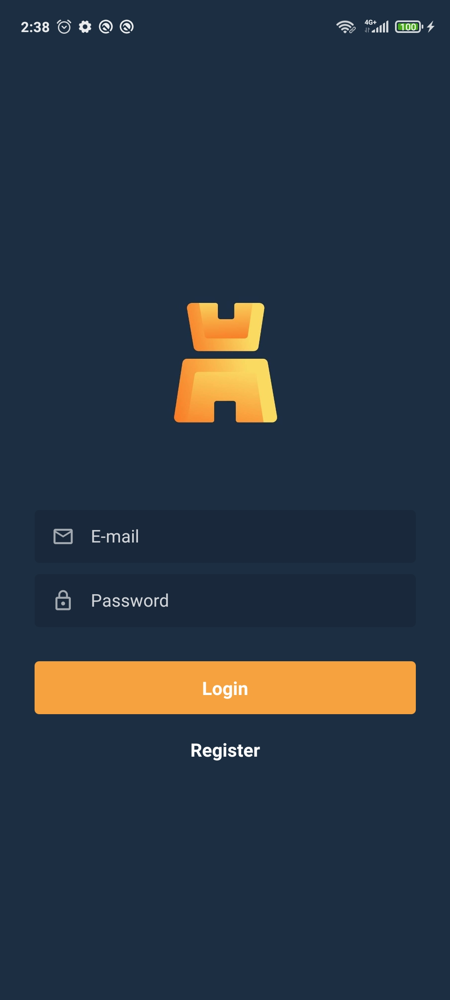
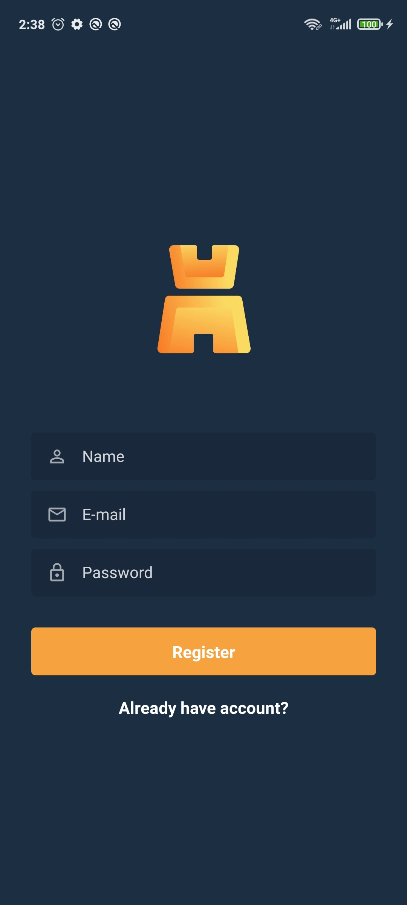
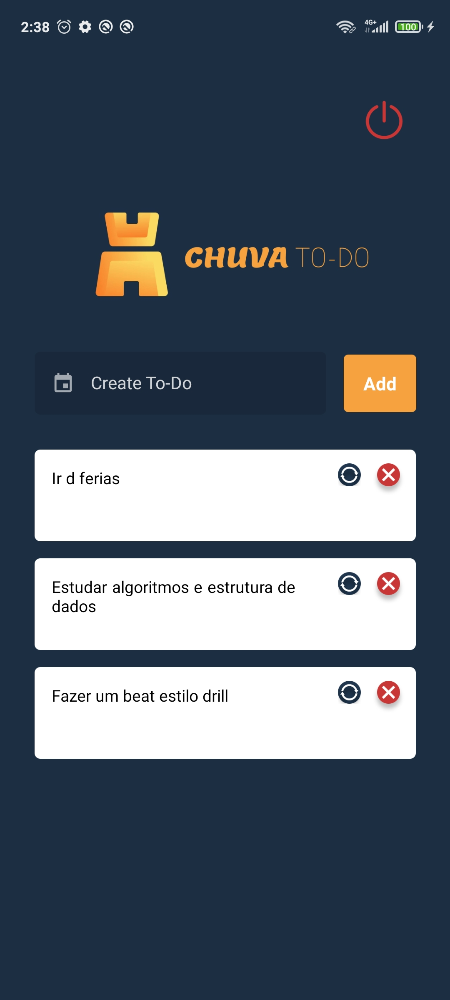

# Chuva Mobile app

# Link for layout Build in Figma
  - https://www.figma.com/file/fQZUiE0EexSNbW9nyVizBf/Untitled?node-id=0%3A1

# Screenshot
  

## Technologies used
  - React Native
  - Redux/Redux-saga/Redux-persist
  - Axios
  - styled-components
  
# Initial Config
 ## Install all dependencies
      - run command -> **yarn** or **npm install**
      
      ## Run Application
      - run command -> yarn start
      - run command -> npx react-native run-android or npx react-native run-ios
